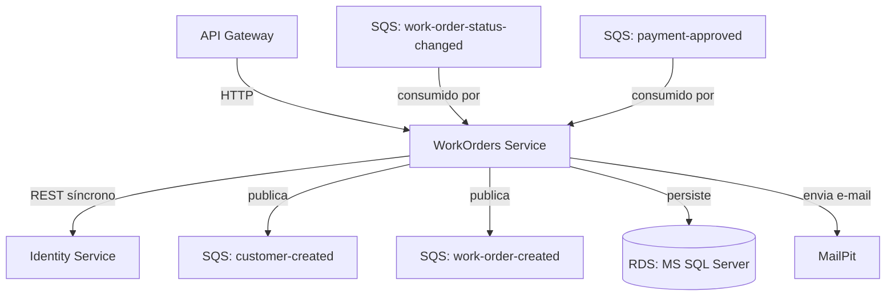

# Work Orders

Gestão de clientes, veículos e ordens de serviço.

## Definição do ambiente

- SDK: .NET 8.0
- Banco de dados: MSSQL 2025
- Serviço de E-mail: MailPit
- Chave pública para JWT: AWS Secrets Manager



## Messageria

As filas devem ser criadas pela camada `messaging` do [repositório de infraestrutura](https://github.com/FIAP-POS-TECH-13SOAT-MECHANICS/mechanics-infra).

### Publishers

| Fila                                        | Descrição                                                        |
|---------------------------------------------|------------------------------------------------------------------|
| `fiap-mechanics-{env}-customer-created`     | Publicado ao cadastrar um novo cliente, para criação de acesso.  |
| `fiap-mechanics-{env}-work-order-created`   | Publicado ao abrir uma nova ordem de serviço.                    |

### Consumers

| Fila                                             | Descrição                                                      |
|--------------------------------------------------|----------------------------------------------------------------|
| `fiap-mechanics-{env}-work-order-status-changed` | Atualiza o status da OS conforme progresso no Execution.       |
| `fiap-mechanics-{env}-payment-approved`          | Marca a OS como paga, liberando a retirada do veículo.         |

## Serviços consumidos

- [Identity](https://github.com/FIAP-POS-TECH-13SOAT-MECHANICS/mechanics-identity): validação de usuário externo por REST (CrossServiceClient).

## Execução do projeto

Em cada nova fase do projeto, é recomendável apagar os volumes do Docker para evitar conflitos com a estrutura do banco
de dados criado em fases anteriores. Para fazer isso, execute o seguinte comando na raiz do projeto:

```bash
docker compose down -v
```

### Execução local (Debug)

Ao executar o projeto em modo DEBUG, o token de autenticação **NÃO** é validado, portanto pode-se usar um token expirado ou mesmo gerar um com uma chave genérica, facilitando o desenvolvimento.

Primeiro inicie o banco de dados e serviço de e-mail:

```bash
docker compose up mssql mailpit localstack -d
```

Aguarde até o serviço `mssql` estar iniciando. O processo leva cerca de 40 segundos.
Com os recursos em execução, execute o projeto com o comando abaixo:

```bash
dotnet run --project ./src/Mechanics.Api/Mechanics.Api.csproj
```

Caso precise gerar um novo token, use o script `new-token.ps1`:

```powershell
.\scripts\new-token.ps1
```

### Docker Compose (Release)

Para rodar o projeto via Docker Compose, é necessário primeiro obter a chave pública no AWS Secrets Manager (ajuste o nome de acordo o ambiente).
Ela é gerada na camada `auth`. Consulte o [repositório de infraestrutura](https://github.com/FIAP-POS-TECH-13SOAT-MECHANICS/mechanics-infra) para mais informações.

```powershell
aws secretsmanager get-secret-value --secret-id "fiap-mechanics-dev-jwt/public-key" --query SecretString --output text > "src/Mechanics.Api/keys/jwt-public.pem"
```

Inicie o projeto via Docker Compose:

```bash
docker compose up -d --build
```

Após o processo concluir, o projeto estará disponível nas seguintes URLs:

- Swagger do projeto: <http://localhost:5000/work-orders/swagger>
- Cliente de e-mail: <http://localhost:8025>

Utilize o script `invoke-getToken.ps1` para obter um token de acesso. É necessário que o serviço [Mechanics.Auth](https://github.com/FIAP-POS-TECH-13SOAT-MECHANICS/mechanics-auth) já esteja em execução.

## Migrações

Criar migração:

```powershell
dotnet ef migrations add Init --project src/Mechanics.Infra.Data --startup-project src/Mechanics.Api
```

Aplicar no banco:

```powershell
dotnet ef database update --project src/Mechanics.Infra.Data --startup-project src/Mechanics.Api
```

## Pipeline de CI/CD

Ao criar uma PR para as branches abaixo, os testes automatizados serão executados.
Ao completar o PR, os testes são novamente executados e é feito o deploy no ambiente.

| Branch    | Ambiente    |
|-----------|-------------|
| `main`    | Production  |
| `release` | Staging     |
| `develop` | Development |
